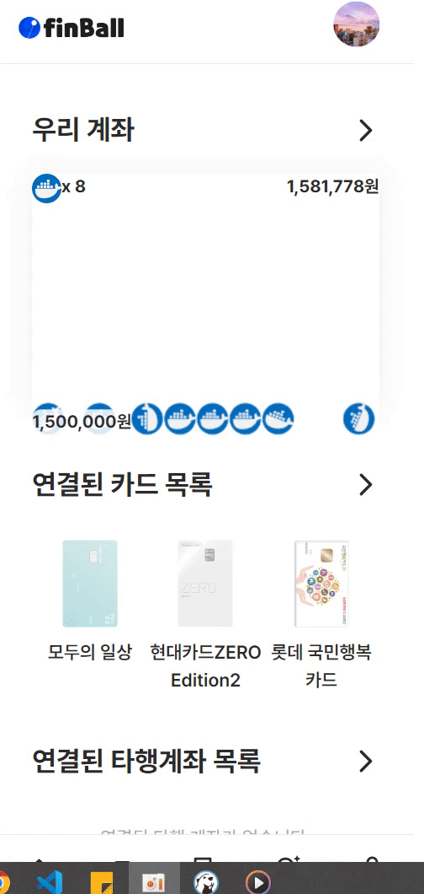

# 🧿 finBall (SSAFY 9기 부울경 E106 핫식스더킹제로)

 

  
  <h3>자산의 시각화를 제공하는 인터넷 전문 은행</h3>

## ⌨️ 기간

- **2023.08.21 ~ 2023.10.06(7주)**

 

## 🔎 목차

1. <a href="#subject">🎯 주제</a>
1. <a href="#mainContents">⭐️ 주요 기능</a>
1. <a href="#systemArchitecture">⚙ 시스템 아키텍쳐</a>
1. <a href="#skills">🛠️ 기술 스택</a>
1. <a href="#erd">💾 ERD</a>
1. <a href="#contents">🖥️ 화면 소개</a>
1. <a href="#developers">👥 팀원 소개</a>

 

<!------- 주제 시작 -------->

## 🎯 주제

**finBall**은 돈을 시각적으로 보여주기 위해 공을 사용합니다. 

공을 통해 자신의 계좌 잔액을 볼 수 있으며, 공을 통한 재미있는 정산 방식인 **핀볼 정산**을 제공합니다.

**주요 기능**

- 모임 통장
- 가계부
- 금융 학습

<a href="#tableContents">목차로 이동</a>

 

<!------- 주요 기능 시작 -------->

## ⭐️ 주요 기능

### 모임 통장

<h4> 모임 통장을 만들 수 있으며, 핀볼 정산 서비스를 제공합니다.</h4>

- 상대방에게 문자 메시지를 통해, 모임 통장초대 링크를 보냅니다.
- 모임통장의 핀볼 정산은 정산 시 게임이 진행되며, 게임 결과에 따라 개인의 정산 금액이 결정됩니다.

---

### 가계부

<h4>finBall 계좌를 만들면 가계부를 생성할 수 있습니다.</h4>

- 목표 금액과 가계부로 관리할 항목을 입력하면 가계부 기능을 사용할 수 있습니다.
- 가계부는 핀볼 거래 내역에서 쉽게 작성 가능합니다.

---

### 금융 학습

<h4>ChatGPT를 이용하여 금융 학습 서비스를 제공합니다.</h4>

- 생성형 AI인 ChatGPT와 대화할 수 있는 공간을 제공합니다.
- ChatGPT에 금융 전문가의 역할을 부여했으며, 금융 지식을 전문적으로 답변을 제공합니다.

<a href="#tableContents">목차로 이동</a>

 

<!------- 시스템 아키텍쳐 시작 -------->

## ⚙ 시스템 아키텍쳐

- FinBall 서버 : 핀볼 서비스 
- Mydata 서버 : 은행 공동망(대외계)

은행 업무를 위해 타행 관련 서비스를 위해 금융 시스템의 대외계 채널의 아키텍처를 활용했습니다. FinBall서버와 Mydata 서버간 통신을 통해 데이터 공유 및 결제 처리를 했습니다.

<a href="#tableContents">목차로 이동</a>

 

<!------- 기술 스택 시작 -------->

## 🛠️ 기술 스택

### 프론트

---

### 백엔드

---

### 협업

<a href="#tableContents">목차로 이동</a>

 

<!------- ERD 시작 -------->

## 💾 ERD
### 핀볼 ERD

---
### 마이데이터 ERD

<a href="#tableContents">목차로 이동</a>

 

<!------- 화면 소개 시작 -------->

 

## 🖥️ 화면 소개

### 1. 핀볼 계좌

<table>
    <tr>
        <td align="center">
            <h5>핀볼 계좌 채우기</h5>
              
        </td>
        <td align="center">
            <h5>핀볼 계좌 이체</h5>
              
        </td> 
        <td align="center">
            <h5>가계부</h5>
            
        </td>
    </tr>
    <tr>
      <td align="center">
        
✔ 핀볼 서비스에 등록된 계좌에서 입금

      </td>
      <td align="center">
        
✔ 핀볼 계좌에서 다른 계좌로의 이체

      </td>
      <td align="center">
        
✔ 가계부 생성 및 항목 지정

        
✔ 거래 내역에서 항목 선택 시 가계부 반영

      </td>
    </tr>
</table>

### 2. 모임 통장

<table>
    <tr>
        <td align="center">
            <h5>모임 계좌 생성</h5>
              
        </td>
        <td align="center">
            <h5>모임 계좌 채우기</h5>
              
        </td> 
        <td align="center">
            <h5>모임 계좌로 결제</h5>
            
        </td>
        <td align="center">
            <h5>간편 정산</h5>
            
        </td>
    </tr>
    <tr>
      <td align="center">
        
✔ 모임 계좌 생성 시 계좌 이름과 정산 방식 설정

      </td>
      <td align="center">
        
✔ 모임 계좌의 채우기 버튼을 통해 채우기

      </td>
      <td align="center">
        
✔ 핀볼 정산을 선택했을 시, 게임을 통해 정산 진행

      </td>
      <td align="center">
        
✔ 모임 계좌가 없거나, 간편하게 정산을 하기 위한 서비스

      </td>
    </tr>
</table>

### 3. 타행

<table>
    <tr>
        <td align="center">
            <h5>카드 연결</h5>
              
        </td>
        <td align="center">
            <h5>카드 결제</h5>
              
        </td> 
        <td align="center">
            <h5>계좌 연결</h5>
            
        </td>
        <td align="center">
            <h5>계좌 결제</h5>
            
        </td>
    </tr>
    <tr>
      <td align="center">
        
✔ 대외계 접근을 위해 주민번호 인증

        
✔ 대외계 서버에 존재하는 카드 정보 조회 및 등록
  
      </td>
      <td align="center">
      </td>
      <td align="center">
        
✔ 대외계 접근을 위해 주민번호 인증

        
✔ 대외계 서버에 존재하는 계좌 정보 조회 및 등록

      </td>
      <td align="center">
        
✔ 대외계 서버에 있는 계좌로 결제

      </td>
    </tr>
</table>

### 4. 금융 학습

<table>
    <tr>
        <td align="center">
            <h5>GPT 학습</h5>
              
        </td>
        <td align="center">
            <h5>금융 퀴즈</h5>
              
        </td> 
        <td align="center">
            <h5>계좌 연결</h5>
            
        </td>
    </tr>
    <tr>
      <td align="center">
        
✔ ChatGPT를 활용한 금융 학습
  
      </td>
      <td align="center">
        
✔ 금융 퀴즈로 포인트 획득
  
      </td>
      <td align="center">
        
✔ 획득한 포인트로 공 구매

        
✔ 구매한 공 선택으로 스킨 적용

      </td>
    </tr>
</table>

<a href="#tableContents">목차로 이동</a>

 

### ✔ 프로젝트 결과물

---

<!-- - [포팅메뉴얼] -->

- [중간발표자료](./ppt/핀볼_중간발표.pptx)
- [최종발표자료](./ppt/핀볼_최종발표.pptx)
<!-- - [최종발표자료] -->

<!------- 팀원 소개 시작 -------->

## 👥 팀원 소개

|  **Name**   |                                                  정영빈                                                   |                                                  서정희                                                   |                                                  정현우                                                   |                                                  신현탁                                                   |                                                  하성호                                                   |                                                  김정희                                                   |
| :---------: | :-------------------------------------------------------------------------------------------------------: | :-------------------------------------------------------------------------------------------------------: | :-------------------------------------------------------------------------------------------------------: | :-------------------------------------------------------------------------------------------------------: | :-------------------------------------------------------------------------------------------------------: | :-------------------------------------------------------------------------------------------------------: |
|  **역할**   |                                                  풀스택                                                   |                                                프론트엔드                                                 |                                                  풀스택                                                   |                                                프론트엔드                                                 |                                                  풀스택                                                   |                                                  풀스택                                                   |
| **profile** |  |  |  |  |  |  |
|  **전공**   |                                               컴퓨터공학과                                                |                                                화학공학과                                                 |                                             에너지자원공학과                                              |                                                기계공학과                                                 |                                         수산경영학과,컴퓨터공학과                                         |                                              전산전자공학부                                               |

<a href="#tableContents">목차로 이동</a>

